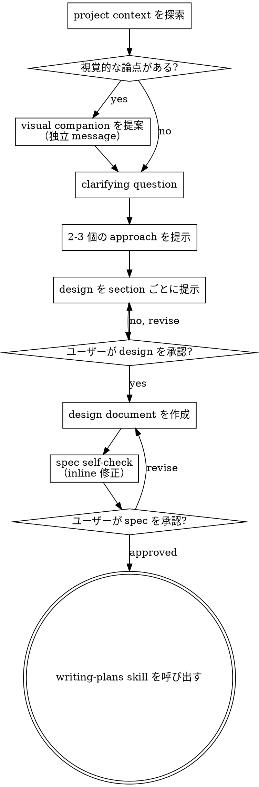

# Brainstorming: アイデアを設計へ変換する

自然な協業対話を通じて、アイデアを実装可能な design と specification に育てる。

まず現在の project context を理解し、質問を一つずつ行って idea を具体化する。何を作るべきか理解できたら、設計案を提示し、ユーザーの承認を得る。

<HARD-GATE>
設計案を提示し、ユーザーの承認を得るまで、実装 skill を呼び出さない。code を書かない。project を scaffold しない。実装作業を始めない。これは、どれほど簡単に見える project にも適用する。
</HARD-GATE>

## Anti-pattern: 「これは簡単なので設計はいらない」

すべての project でこの process を通る。Todo list、単一関数の tool、設定変更も例外ではない。「簡単」な project ほど、未検証の前提で手戻りが起きやすい。設計は短くてよい。実際に単純なら数文で足りる。ただし、必ず提示し、承認を得る。

## Checklist

次の各項目を task として作成し、順番に完了する。

1. **project context を探索する** — file、document、最近の commit を確認する
2. **visual companion を提案する**（視覚的な論点がある場合）— これは独立した message とし、clarifying question と混ぜない。下の「Visual Companion」を参照する
3. **clarifying question を行う** — 一度に一つだけ。目的、制約、成功条件を確認する
4. **2-3 個の approach を提示する** — trade-off と推奨案を含める
5. **design を提示する** — 複雑さに応じて section 分けし、各 section ごとに承認を得る
6. **design document を書く** — `docs/superpowers/specs/YYYY-MM-DD-<topic>-design.md` に保存し、commit する
7. **spec self-check を行う** — placeholder、矛盾、曖昧さ、scope を inline で確認し修正する
8. **書面 spec をユーザーに review してもらう** — 続行前に spec file の review を依頼する
9. **implementation へ移行する** — `writing-plans` skill を呼び出し、実装計画を作る

## Flow

**終了状態は `writing-plans` の呼び出し。** `frontend-design`、`mcp-builder`、その他の実装 skill は呼び出さない。brainstorming の後に呼び出す唯一の skill は `writing-plans`。

## Process Details

**idea を理解する:**

- まず現在の project 状態を確認する（file、document、最近の commit）
- 詳細な質問を始める前に scope を見積もる。要求が複数の独立 subsystem を含む場合（例: chat、file storage、billing、analytics を含む platform）、すぐに指摘する。質問で巨大 project を細かく詰めようとしない。
- project が大きすぎて単一 spec で扱えない場合は、subproject に分解する。独立部分、相互関係、構築順序を整理し、最初の subproject から通常の design process に入る。各 subproject は独自の spec → plan → implementation cycle を持つ。
- scope が適切な場合は、一度に一つの質問で idea を具体化する
- 可能な限り選択式の質問を使う。必要なら open question も使う
- 一つの message で一つの質問だけ行う。追加探索が必要なら複数 message に分ける
- 目的、制約、成功条件を重点的に理解する

**approach を探索する:**

- 2-3 個の異なる approach と trade-off を提示する
- 会話的に option を示し、自分の推奨案と理由を添える
- 推奨案を最初に示し、その理由を説明する

**design を提示する:**

- 何を作るべきか理解できたら design を提示する
- 各 section の長さは複雑さに合わせる。単純なら数文、複雑なら 200-300 words 程度まで
- 各 section の後で、内容が合っているか確認する
- architecture、component、data flow、error handling、testing を扱う
- 不明点が出たら、いつでも戻って確認する

**分離性と明確さを意識した design:**

- system を小さな unit に分ける。各 unit は明確な責務を持ち、定義された interface で通信し、単独で理解・test できるようにする
- 各 unit について「何をするか」「どう使うか」「何に依存するか」を答えられるようにする
- 内部実装を読まなくても unit の役割を理解できるか。呼び出し側に影響せず内部を変更できるか。できないなら boundary を見直す
- 小さく境界が明確な unit は agent にとっても扱いやすい。context に収まる code ほど推論しやすく、file が focused であるほど編集の信頼性も上がる。file が大きくなるときは、多くの場合、責務が増えすぎている

**既存 codebase で作業する場合:**

- 変更を提案する前に既存構造を探索し、既存 pattern に従う
- 現在の作業に影響する問題（巨大 file、境界不明、責務の絡まりなど）がある場合は、対象を絞った改善を design に含める。優れた developer が触れた範囲を少し良くするのと同じ
- 無関係な refactor は提案しない。現在の目的に必要なことへ集中する

## Design の後

**Document:**

- 検証済みの design（spec）を `docs/superpowers/specs/YYYY-MM-DD-<topic>-design.md` に保存する
  - spec 保存場所についてユーザーの希望がある場合は、それを優先する
- 利用可能なら `elements-of-style:writing-clearly-and-concisely` skill を使う
- design document を git commit する

**Spec self-check:**

spec document を書いた後、新しい視点で確認する。

1. **placeholder scan:** 「TBD」「TODO」、未完成 section、曖昧な requirement がないか。見つけたら修正する
2. **internal consistency:** section 間に矛盾がないか。architecture と機能説明が一致しているか
3. **scope check:** 一つの implementation plan で扱える範囲か。さらに分割すべきか
4. **ambiguity check:** 2 通りに解釈できる requirement がないか。ある場合は一つを選んで明記する

問題を見つけたら inline で修正する。再 review を待つ必要はない。修正して続行する。

**User review gate:**

self-check 後、続行前にユーザーへ書面 spec の review を依頼する。

> 「spec を作成し、`<path>` に commit しました。実装計画に進む前に review してください。変更したい点があれば教えてください。」

ユーザーの返答を待つ。修正依頼があれば対応し、spec self-check を再実行する。ユーザーが承認してから次へ進む。

**Implementation:**

- `writing-plans` skill を呼び出し、詳細な implementation plan を作る
- 他の skill は呼び出さない。次は `writing-plans` のみ

## Core Principles

- **一度に一つの質問** — 複数の質問を同時に投げない
- **選択式を優先** — 可能な場合、open question より答えやすい
- **YAGNI を厳守** — 不要な機能を design から外す
- **代替案を探索** — 決定前に必ず 2-3 個の approach を出す
- **incremental validation** — design を示し、承認を得てから進む
- **柔軟に戻る** — 不明点があれば戻って確認する

## Visual Companion

brainstorming 中に prototype、diagram、visual option を表示する browser-based companion tool。これは tool であり、mode ではない。companion の利用に同意された場合でも、すべての質問を browser で扱うわけではない。

**companion を提案する:** 後続の質問に visual content（prototype、layout、diagram）が含まれそうな場合、一度だけ同意を取る。

> 「この後の相談内容は、browser 上で見える形にすると判断しやすいものがありそうです。必要に応じて prototype、diagram、比較画面などを作れます。この機能はまだ新しく、token を多めに使う可能性があります。試しますか。（local URL を開く必要があります）」

**この提案は独立した message にする。** clarifying question、context summary、その他の内容と混ぜない。message には上記の提案だけを書く。ユーザーの返答を待ってから続行する。拒否された場合は text-only の brainstorming を続ける。

**質問ごとに判断する:** ユーザーが同意しても、各質問で browser を使うか terminal で済ませるか判断する。基準は、**読むより見る方が理解しやすいか**。

- **browser を使う:** prototype、wireframe、layout 比較、architecture diagram、並列 visual design など、内容自体が視覚的なもの
- **terminal を使う:** requirement question、conceptual option、trade-off list、A/B/C/D の text option、scope decision など

UI topic でも、すべてが visual question ではない。「この文脈で personalization とは何か」は conceptual question なので terminal を使う。「どの wizard layout が良いか」は visual question なので browser を使う。

ユーザーが companion 利用に同意した場合、続行前に詳細 guide を読む。

`skills/brainstorming/visual-companion.md`
