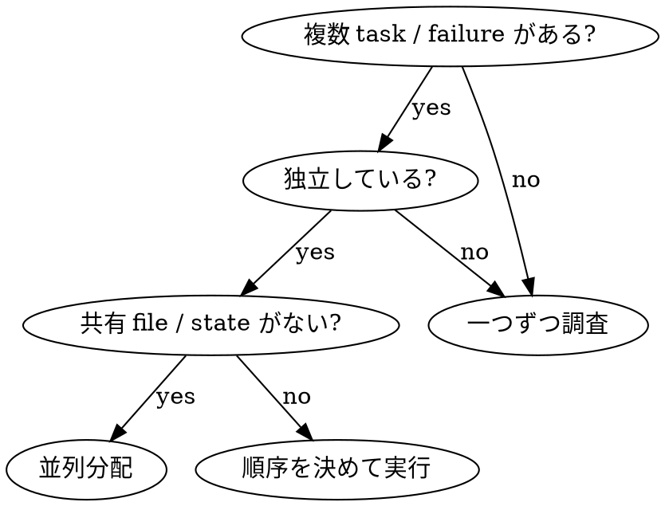

# 並列 Agent に分配する

## 概要

独立した問題領域を、隔離された context を持つ専用 agent に並列で任せます。各 agent には、必要な file、error、制約、期待 output だけを渡します。自分の会話履歴を丸ごと継承させず、task-local な context を設計してください。

**原則:** 独立した問題領域ごとに 1 agent を割り当て、同時に調査・修正させます。

## いつ使うか

使う:
- 2 つ以上の独立 task がある
- 複数 test file が別々の root cause で失敗している
- subsystem ごとに調査を分けられる
- agent 同士が同じ file / resource を触らない
- 順序依存がない

使わない:
- 1 つの修正で他の失敗も直りそう
- system 全体の文脈をまとめて理解する必要がある
- まだ何が壊れているか分類できていない
- agent 同士が同じ file を編集しそう
- shared state や外部 resource で干渉する

判断:



## Workflow

### 1. 問題領域を分ける

failure を root cause の候補で group 化します。

例:
- `agent-tool-abort.test.ts`: abort と partial output
- `batch-completion-behavior.test.ts`: batch completion
- `tool-approval-race-conditions.test.ts`: approval race

それぞれが別 file、別 behavior、別 root cause なら並列化できます。

### 2. Agent task を小さく書く

各 agent prompt には次を含めます。

- **Scope:** 対象 file / subsystem
- **Goal:** 何を通すか、何を明らかにするか
- **Context:** error message、test name、関連 command
- **Constraints:** 触ってよい file、避ける変更
- **Expected output:** root cause、変更内容、検証結果

### 3. 並列で起動する

利用可能な platform の subagent / Task 機能で同時に依頼します。subagent がない環境では、worktree や別 session を使うか、順序実行に切り替えます。

### 4. 統合する

agent が戻ったら:

1. 各 summary を読む
2. 変更範囲を確認する
3. 同じ file / logic への conflict がないか見る
4. full test suite または該当 integration test を実行する
5. 必要なら自分で最終調整する

## Prompt Template

```markdown
Scope:
- Fix failures in `src/agents/agent-tool-abort.test.ts` only.

Failures:
1. "should abort tool with partial output capture"
   Expected message to contain "interrupted at"
2. "should handle mixed completed and aborted tools"
   Fast tool is aborted instead of completed
3. "should properly track pendingToolCount"
   Expected 3 results, got 0

Context:
- These look like timing / race-condition failures.
- Relevant command: `npm test -- agent-tool-abort.test.ts`

Constraints:
- Do not broaden timeouts as the primary fix.
- Prefer event-based waiting.
- Do not modify unrelated production code.

Return:
- Root cause
- Files changed
- Verification command and result
- Any remaining risk
```

## Common Mistakes

**Too broad:** "Fix all tests"  
Agent loses focus. Give one file or one subsystem.

**No context:** "Fix race condition"  
Agent needs exact failure output and relevant command.

**No constraints:** Agent may refactor unrelated code.  
State what it may and may not touch.

**Vague output:** "Fix it"  
Require root cause, diff summary, and verification.

**Skipping integration:** Parallel fixes can conflict indirectly.  
Always run a combined verification after merging results.

## Verification

After all agents return:

- [ ] Every agent returned root cause and verification
- [ ] Diff touches expected files only
- [ ] No two agents edited the same logic unexpectedly
- [ ] Targeted tests pass
- [ ] Full relevant suite passes
- [ ] Remaining risks are documented

## Practical Notes

Parallel agents are strongest when each task has narrow scope and enough evidence to start immediately. If you are still discovering the shape of the problem, first do a short classification pass, then dispatch.
