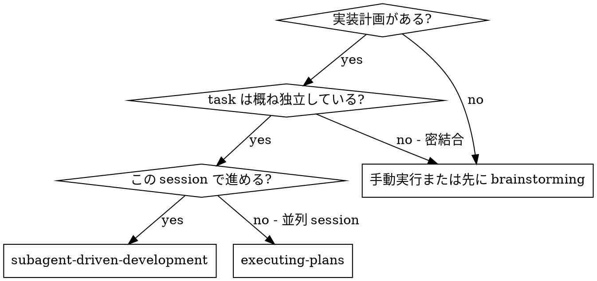
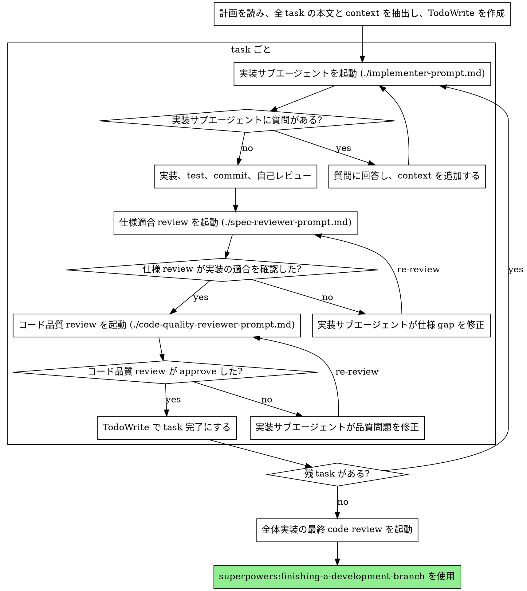

# サブエージェント駆動開発

実装計画を task ごとに新しいサブエージェントへ委譲し、各 task の完了後に 2 段階 review を行います。順序は必ず、仕様適合 review、その後にコード品質 review です。

**なぜサブエージェントを使うか:** 専用の agent に、隔離された context で task を任せられます。必要な指示と context をこちらで精密に渡すことで、agent は担当 task に集中できます。サブエージェントには現在 session の履歴を継承させず、必要な情報だけを渡してください。これにより、制御側の context は計画管理と判断に残せます。

**基本原則:** task ごとに新しいサブエージェント + 2 段階 review（仕様、品質）= 高品質で速い iteration

**継続実行:** task ごとにユーザーへ「続けますか」と確認しないでください。計画に含まれる task は停止せずに進めます。止まる理由は、解消できない BLOCKED、進行不能な曖昧さ、または全 task 完了だけです。ユーザーは計画実行を依頼しているため、途中確認ではなく実行を優先します。

## いつ使うか



**Executing Plans（並列 session）との違い:**
- 同じ session で進めるため context switch が少ない
- task ごとに新しいサブエージェントを使うため context 汚染が起きにくい
- 各 task の後に 2 段階 review を行う: 仕様適合、コード品質
- task 間で人の介入を待たないため iteration が速い

## 流れ



## モデル選択

コストと速度のため、各 role を処理できる最小限の model を使います。

**機械的な実装 task**（独立した関数、明確な仕様、1-2 files）: 速く安い model。計画が十分具体的なら、多くの実装 task は機械的です。

**統合と判断が必要な task**（複数 files の調整、既存 pattern の把握、debug）: 標準 model。

**設計、architecture、review task**: 利用可能な最も強い model。

**task 複雑度の signal:**
- 1-2 files で仕様が完全 → cheaper model
- 複数 files と統合考慮がある → standard model
- 設計判断や広範な codebase 理解が必要 → strongest model

## 実装者 status の扱い

実装サブエージェントは 4 つの status のいずれかを返します。

**DONE:** 仕様適合 review に進みます。

**DONE_WITH_CONCERNS:** 実装は完了したが懸念があります。review 前に懸念を読みます。正しさや scope に関わる懸念なら先に解消します。単なる観察（例: 「この file が大きくなっている」）なら記録して review へ進みます。

**NEEDS_CONTEXT:** 提供されていない情報が必要です。不足 context を渡して再起動します。

**BLOCKED:** 実装者が完了できません。blocker を評価します。
1. context 不足なら追加 context を渡し、同じ model で再起動する
2. reasoning が不足しているなら、より強い model で再起動する
3. task が大きすぎるなら、小さく分割する
4. 計画自体に問題があるなら、ユーザーへ escalation する

**絶対に** escalation を無視したり、何も変えずに同じ model へ再試行させたりしないでください。実装者が詰まったと言う場合、何かを変える必要があります。

## Prompt templates

- `./implementer-prompt.md` - 実装サブエージェントを起動する
- `./spec-reviewer-prompt.md` - 仕様適合 review サブエージェントを起動する
- `./code-quality-reviewer-prompt.md` - コード品質 review サブエージェントを起動する

## 例

```text
あなた: サブエージェント駆動開発でこの計画を実行します。

[計画 file を一度読む: docs/superpowers/plans/feature-plan.md]
[全 5 task の本文と context を抽出]
[TodoWrite に全 task を作成]

Task 1: Hook installation script

[task 1 の本文と context を取得（すでに抽出済み）]
[実装サブエージェントへ、task 全文 + context を渡す]

実装者: "始める前に確認です。hook は user level と system level のどちらへ入れますか?"

あなた: "user level（~/.config/superpowers/hooks/）です"

実装者: "了解しました。実装します..."
[後で] 実装者:
  - install-hook command を実装
  - test 追加、5/5 passing
  - 自己レビュー: --force flag の漏れを発見し追加
  - commit 済み

[仕様適合 review を起動]
仕様 reviewer: ✅ 仕様適合 - すべての要件を満たし、余計な実装はありません

[git SHA を取得し、コード品質 review を起動]
code reviewer: Strengths: test coverage が良く、実装も明瞭。Issues: なし。Approved.

[task 1 を完了にする]

Task 2: Recovery modes

[task 2 の本文と context を取得（すでに抽出済み）]
[実装サブエージェントへ、task 全文 + context を渡す]

実装者: [質問なしで進行]
実装者:
  - verify / repair mode を追加
  - 8/8 tests passing
  - 自己レビュー: 問題なし
  - commit 済み

[仕様適合 review]
仕様 reviewer: ❌ Issues:
  - Missing: progress reporting（仕様では "100 件ごとに報告"）
  - Extra: --json flag を追加している（要求外）

[実装者が修正]
実装者: --json flag を削除し、progress reporting を追加しました

[仕様 reviewer が再 review]
仕様 reviewer: ✅ 仕様適合

[コード品質 review]
code reviewer: Strengths: solid. Issues (Important): magic number (100)

[実装者が修正]
実装者: PROGRESS_INTERVAL constant を抽出しました

[code reviewer が再 review]
code reviewer: ✅ Approved

[task 2 を完了にする]

...

[全 task 完了後]
[最終 code-reviewer を起動]
final reviewer: 全要件を満たしています。merge 可能です。

Done.
```

## 利点

**手動実行と比べて:**
- サブエージェントが自然に TDD に従いやすい
- task ごとに新しい context なので混乱しにくい
- 並列安全性が高い（agent 同士が干渉しにくい）
- サブエージェントが実装前にも実装中にも質問できる

**Executing Plans と比べて:**
- 同じ session で進むため引き継ぎが少ない
- 人の確認待ちで止まりにくい
- review checkpoint が自動化される

**効率面:**
- file 読み込み overhead が少ない（制御者が全文を渡す）
- 制御者が必要 context を精密に選べる
- サブエージェントが最初から完全な情報を受け取る
- 質問が作業開始前に表面化する（完了後ではない）

**品質 gate:**
- 自己レビューで引き渡し前に問題を見つける
- 2 段階 review: 仕様適合、コード品質
- review loop により修正が本当に効いたか確認する
- 仕様適合により作りすぎ / 作り不足を防ぐ
- コード品質 review により保守しやすい実装にする

**コスト:**
- サブエージェント呼び出しは増える（task ごとに実装者 + 2 reviewers）
- 制御者の準備作業は増える（全 task を先に抽出）
- review loop で iteration は増える
- ただし問題を早期発見でき、後から debug するより安く済む

## Red Flags

**絶対にしないこと:**
- ユーザーの明示同意なく main / master branch で実装を始める
- review を省略する（仕様適合またはコード品質）
- 未修正の問題を残したまま進む
- 複数の実装サブエージェントを並列起動する（conflict の原因）
- サブエージェントに計画 file を読ませる（全文を渡す）
- task の位置づけ context を省く
- サブエージェントの質問を無視する
- 仕様適合で「だいたい OK」を受け入れる（仕様 reviewer が問題を出したら未完了）
- review loop を省く（reviewer が問題を出す = 実装者が修正 = 再 review）
- 実装者の自己レビューを正式 review の代わりにする
- **仕様適合 review が ✅ になる前にコード品質 review を始める**
- どちらかの review に open issue があるまま次 task へ進む

**サブエージェントが質問したら:**
- 明確かつ完全に回答する
- 必要なら追加 context を渡す
- 急かして実装に入らせない

**reviewer が問題を見つけたら:**
- 実装者（同じサブエージェント）に修正させる
- reviewer が再 review する
- approve まで繰り返す
- 再 review を省略しない

**サブエージェントが task に失敗したら:**
- 具体的な指示を渡して修正サブエージェントを起動する
- 制御者が手動で直さない（context 汚染を避ける）

## Integration

**必須 workflow skills:**
- **superpowers:using-git-worktrees** - 作業 workspace を隔離する
- **superpowers:writing-plans** - この skill で実行する計画を作成する
- **superpowers:requesting-code-review** - review サブエージェント用の code review template
- **superpowers:finishing-a-development-branch** - 全 task 完了後の finishing

**サブエージェントが使うべき skill:**
- **superpowers:test-driven-development** - 各 task で TDD に従う

**代替 workflow:**
- **superpowers:executing-plans** - 同一 session ではなく並列 session で実行する場合に使う
