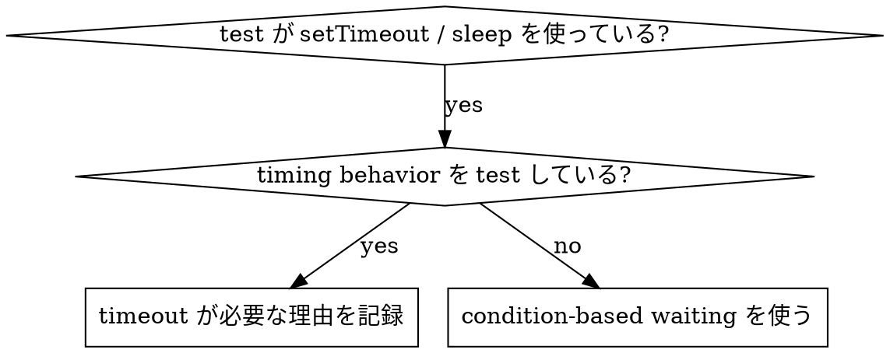

# Condition-Based Waiting

## Overview

flaky test は hard-coded delay で timing を推測しがちである。これは race condition を作る。速い machine では pass し、high load や CI では fail する。

**Core principle:** どれくらい待つかを guess するのではなく、本当に必要な condition を待つ。

## When To Use



**Use when:**

- test に hard-coded delay がある（`setTimeout`、`sleep`、`time.sleep()`）
- test が flaky（時々 pass、high load で fail）
- parallel run で timeout する
- async operation の完了を待っている

**Do not use when:**

- actual timing behavior を test している（debounce、throttle interval）
- hard-coded timeout を使う場合は、必ず理由を comment する

## Core Pattern

```typescript
// before: timing を guess
await new Promise(r => setTimeout(r, 50));
const result = getResult();
expect(result).toBeDefined();

// after: condition を待つ
await waitFor(() => getResult() !== undefined);
const result = getResult();
expect(result).toBeDefined();
```

## Common Patterns

| Scenario | Pattern |
| --- | --- |
| event を待つ | `waitFor(() => events.find(e => e.type === 'DONE'))` |
| state を待つ | `waitFor(() => machine.state === 'ready')` |
| count を待つ | `waitFor(() => items.length >= 5)` |
| file を待つ | `waitFor(() => fs.existsSync(path))` |
| compound condition | `waitFor(() => obj.ready && obj.value > 10)` |

## Implementation

generic polling function:

```typescript
async function waitFor<T>(
  condition: () => T | undefined | null | false,
  description: string,
  timeoutMs = 5000
): Promise<T> {
  const startTime = Date.now();

  while (true) {
    const result = condition();
    if (result) return result;

    if (Date.now() - startTime > timeoutMs) {
      throw new Error(`Timeout waiting for ${description} after ${timeoutMs}ms`);
    }

    await new Promise(r => setTimeout(r, 10)); // poll every 10ms
  }
}
```

complete implementation と domain-specific helper（`waitForEvent`、`waitForEventCount`、`waitForEventMatch`）は同 directory の `condition-based-waiting-example.ts` を参照する。実際の debugging から抽出された例である。

## Common Mistakes

**polling が頻繁すぎる:** `setTimeout(check, 1)` は CPU を浪費する。  
**fix:** 10ms ごとに poll する。

**timeout がない:** condition が永遠に満たされないと infinite loop になる。  
**fix:** 必ず timeout を設定し、clear error message を出す。

**stale data:** loop 外で state を cache している。  
**fix:** loop 内で getter を呼び、latest data を取得する。

## When Hard-Coded Timeout Is Correct

```typescript
// tool は 100ms ごとに tick する。partial output を検証するには 2 tick 必要
await waitForEvent(manager, 'TOOL_STARTED'); // first: condition を待つ
await new Promise(r => setTimeout(r, 200));   // then: known timing に基づく behavior を待つ
// 200ms = 100ms interval の 2 tick。documented で理由がある
```

**Requirements:**

1. まず trigger condition を待つ
2. known timing に基づく（guess ではない）
3. comment で理由を説明する

## Practical Impact

debugging practice（2025-10-03）:

- 3 files の 15 flaky tests を修正
- pass rate: 60% → 100%
- execution time: 40% faster
- race condition が消えた
