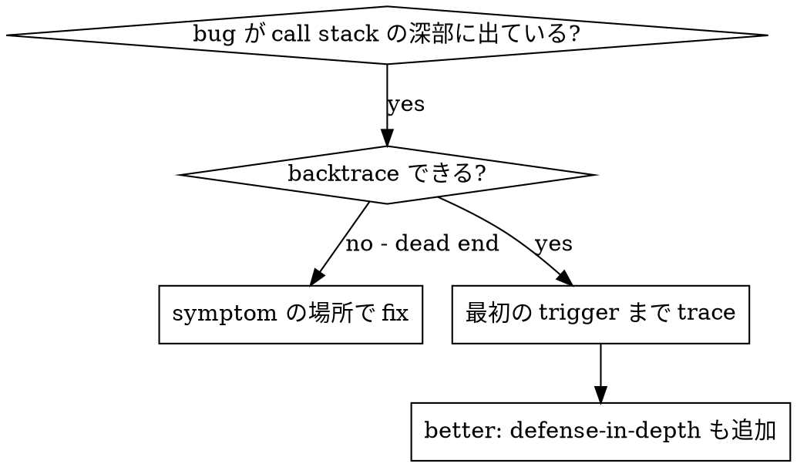
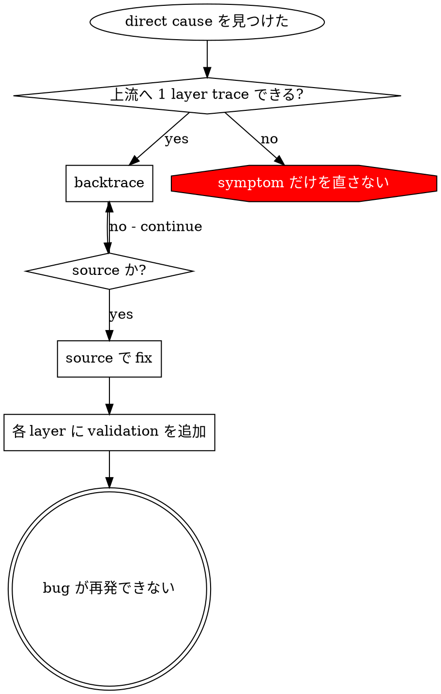

# Root Cause Tracing

## Overview

bug は call stack の深い場所で表面化しやすい（wrong directory で `git init`、wrong location に file 作成、wrong path で database open など）。本能的には error が出た場所を直したくなるが、それは symptom patch である。

**Core principle:** call chain を逆に trace し、最初の trigger を見つけ、source で直す。

## When To Use



**Use when:**

- error が execution の深い場所で起きている（entry point ではない）
- stack trace が長い call chain を示している
- invalid data がどこから来たか分からない
- どの test / code が問題を trigger したか見つける必要がある

## Tracing Process

### 1. Observe The Symptom

```text
Error: git init failed in /Users/jesse/project/packages/core
```

### 2. Find The Direct Cause

**どの code が直接 error を起こしたか。**

```typescript
await execFileAsync('git', ['init'], { cwd: projectDir });
```

### 3. Ask: Who Called This?

```typescript
WorktreeManager.createSessionWorktree(projectDir, sessionId)
  → called by Session.initializeWorkspace()
  → called by Session.create()
  → called by Project.create() in test
```

### 4. Keep Tracing Upward

**どの value が渡されたか。**

- `projectDir = ''`（empty string）
- empty string as `cwd` resolves to `process.cwd()`
- それは source directory である

### 5. Find The Original Trigger

**empty string はどこから来たか。**

```typescript
const context = setupCoreTest(); // returns { tempDir: '' }
Project.create('name', context.tempDir); // beforeEach 前に access している
```

## Add Stack Trace Instrumentation

手動 trace できない場合は diagnostic instrumentation を追加する。

```typescript
// problematic operation の直前
async function gitInit(directory: string) {
  const stack = new Error().stack;
  console.error('DEBUG git init:', {
    directory,
    cwd: process.cwd(),
    nodeEnv: process.env.NODE_ENV,
    stack,
  });

  await execFileAsync('git', ['init'], { cwd: directory });
}
```

**重要:** test では `console.error()` を使う。logger は suppress されることがある。

**run and capture:**

```bash
npm test 2>&1 | grep 'DEBUG git init'
```

**analyze stack trace:**

- test file name を探す
- trigger call の line number を探す
- pattern を特定する（同じ test か、同じ parameter か）

## Find The Polluting Test

test 中に特定の現象が出るが、どの test が原因か分からない場合:

同 directory の binary search script `find-polluter.sh` を使う。

```bash
./find-polluter.sh '.git' 'src/**/*.test.ts'
```

test を一つずつ実行し、最初の polluter で停止する。詳細は script の usage を参照する。

## Real Case: Empty projectDir

**Symptom:** `.git` が `packages/core/`（source directory）に作成された。

**trace chain:**

1. `git init` が `process.cwd()` で実行された ← cwd parameter が empty
2. WorktreeManager が empty projectDir を受け取った
3. Session.create() が empty string を渡した
4. test が beforeEach 前に `context.tempDir` へ access した
5. setupCoreTest() の初期値が `{ tempDir: '' }` だった

**root cause:** top-level variable initialization 時に empty value へ access していた。

**fix:** tempDir を getter にし、beforeEach 前に access されたら throw する。

**defense-in-depth も追加:**

- Layer 1: Project.create() が directory を validate
- Layer 2: WorkspaceManager が non-empty を validate
- Layer 3: NODE_ENV guard が tmpdir 外の git init を拒否
- Layer 4: git init 前に stack trace を log

## Key Principle



**error が出た場所だけを直さない。** backtrace し、最初の trigger を見つける。

## Stack Trace Tips

**test 内:** logger ではなく `console.error()` を使う。logger は suppress されることがある。  
**operation 前:** failure 後ではなく dangerous operation の直前に log する。  
**context を含める:** directory、cwd、environment variable、timestamp。  
**stack を capture:** `new Error().stack` は full call chain を表示する。

## Practical Impact

debugging practice（2025-10-03）:

- 5 layer の trace で root cause を発見
- source で fix（getter validation）
- 4 layer の defense-in-depth を追加
- 1847 tests pass、pollution zero
