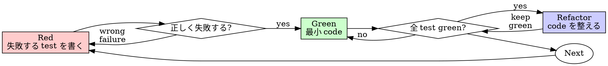

# Test-Driven Development (TDD)

## Overview

先に test を書く。失敗することを見る。通すための最小 code を書く。

**Core principle:** test が失敗するところを見ていなければ、その test が正しいものを検証しているか分からない。

**rule の文字通りの違反は、rule の精神にも違反している。**

## When To Use

**常に使う:**

- new feature
- bug fix
- refactor
- behavior change

**例外（人間の担当者に確認する）:**

- disposable prototype
- generated code
- configuration file

「今回だけ TDD を skip しよう」と考えたら停止する。それは rationalization である。

## Iron Law

```text
失敗する test なしに production code を書かない
```

先に code を書いてから test を書いたか。削除する。最初からやり直す。

**例外なし:**

- 「参考」として残さない
- test を書きながら「改造」しない
- 見ない
- 削除は削除

test から始めて、もう一度実装する。それだけ。

## Red-Green-Refactor



### Red - 失敗する test を書く

期待する behavior を示す最小 test を書く。

<Good>

```typescript
test('retries failed operations 3 times', async () => {
  let attempts = 0;
  const operation = () => {
    attempts++;
    if (attempts < 3) throw new Error('fail');
    return 'success';
  };

  const result = await retryOperation(operation);

  expect(result).toBe('success');
  expect(attempts).toBe(3);
});
```

name が明確。real behavior を test している。一つのことだけを test している。
</Good>

<Bad>

```typescript
test('retry works', async () => {
  const mock = jest.fn()
    .mockRejectedValueOnce(new Error())
    .mockRejectedValueOnce(new Error())
    .mockResolvedValueOnce('success');
  await retryOperation(mock);
  expect(mock).toHaveBeenCalledTimes(3);
});
```

name が曖昧。code ではなく mock を test している。
</Bad>

**Requirements:**

- one behavior
- clear name
- real code を使う（やむを得ない場合だけ mock）

### Verify Red - 失敗を確認する

**必ず実行する。絶対に skip しない。**

```bash
npm test path/to/test.test.ts
```

確認すること:

- test が失敗する（error ではない）
- failure message が期待通り
- failure reason が機能不足（typo ではない）

**test が通ったか。** 既存 behavior を test している。test を修正する。

**test が error になったか。** error を修正し、正しく失敗するまで再実行する。

### Green - 最小 code

test を通すための最も simple な code を書く。

<Good>

```typescript
async function retryOperation<T>(fn: () => Promise<T>): Promise<T> {
  for (let i = 0; i < 3; i++) {
    try {
      return await fn();
    } catch (e) {
      if (i === 2) throw e;
    }
  }
  throw new Error('unreachable');
}
```

test を通すのに必要十分。
</Good>

<Bad>

```typescript
async function retryOperation<T>(
  fn: () => Promise<T>,
  options?: {
    maxRetries?: number;
    backoff?: 'linear' | 'exponential';
    onRetry?: (attempt: number) => void;
  }
): Promise<T> {
  // YAGNI
}
```

over-design。
</Bad>

feature 追加、無関係な refactor、test が要求していない「改善」をしない。

### Verify Green - 通ることを確認する

**必ず実行する。**

```bash
npm test path/to/test.test.ts
```

確認すること:

- 対象 test が通る
- 他の test も通る
- output が clean（error、warning なし）

**test が失敗したか。** test ではなく code を修正する。

**他の test が失敗したか。** すぐに修正する。

### Refactor - code を整える

green の後だけ refactor する。

- duplication を消す
- naming を改善する
- helper function を抽出する

test を green のまま保つ。behavior を追加しない。

### Repeat

次の behavior に対して、次の failing test を書く。

## Good Tests

| Trait | Good | Bad |
| --- | --- | --- |
| **Minimal** | 一つのことだけを test する。name に「and」があるなら分ける。 | `test('validates email and domain and whitespace')` |
| **Clear** | name が behavior を説明している | `test('test1')` |
| **Shows intent** | 期待する API を示す | code が何をすべきか隠している |

## なぜ順序が重要か

**「先に実装してから test で検証する」**

後から書いた test はすぐ通る。すぐ通る test は何も証明しない。

- wrong thing を test しているかもしれない
- behavior ではなく implementation を test しているかもしれない
- 忘れていた edge case を落としているかもしれない
- bug を捕まえるところを一度も見ていない

先に test を書くと、test が失敗することを見るしかない。つまり、何かを実際に検証していることを証明できる。

**「edge case は全部 manual test した」**

manual test は一時的である。全部 test したと思っていても、次の問題が残る。

- test record がない
- code change 後に再実行できない
- pressure 下では忘れる
- 「動かしてみた」は comprehensive test ではない

automated test は systematic である。毎回同じ方法で実行できる。

**「X 時間分の作業を消すのはもったいない」**

sunk cost fallacy。時間はすでに使った。今の選択肢は二つ。

- 削除して TDD で書き直す（さらに X 時間、高 confidence）
- 残して後から test を足す（30 分、低 confidence、bug の可能性）

「もったいない」のは、信頼できない code を残すこと。real test なしに動く code は technical debt である。

**「TDD は教条的すぎる。実務では柔軟さが必要」**

TDD は実務的である。

- commit 前に bug を見つける（後から debug するより速い）
- regression を防ぐ（破壊を test がすぐ示す）
- behavior を記録する（test が使い方を示す）
- refactor を支える（test が破壊を捕まえる）

「実務的」な shortcut = production で debug = より遅い。

**「後から test しても目的は同じ。大事なのは精神であって儀式ではない」**

違う。後から test は「この code は何をしているか」に答える。先に test は「この code は何をすべきか」に答える。

後から test は実装 bias を受ける。build したものを test しているのであって、requirement を test していない。覚えていた edge case だけを検証しているのであって、発見していない。

先に test を書くと、実装前に edge case を見つける。後から test は、すべて覚えていたことを前提にする。実際には覚えていない。

30 分の後付け test は TDD ではない。coverage は得ても、test が有効である証明を失っている。

## Common Excuses

| Excuse | Reality |
| --- | --- |
| 「簡単すぎて test 不要」 | simple code も bug る。test は 30 秒で書ける。 |
| 「後で test を足す」 | すぐ通る test は何も証明しない。 |
| 「後付け test でも同じ」 | 後付け test =「これは何をするか」。先書き test =「これは何をすべきか」。 |
| 「manual test 済み」 | temporary test は systematic test ではない。記録も再現性もない。 |
| 「X 時間分を消すのはもったいない」 | sunk cost fallacy。未検証 code を残すことが technical debt。 |
| 「参考として残し、test を先に書く」 | 必ずそれを改造する。それは後付け test。削除は削除。 |
| 「先に探索が必要」 | よい。探索が終わったら捨てて、TDD で始める。 |
| 「test が書きにくい = design が不明瞭」 | test に従う。test しにくい = 使いにくい。 |
| 「TDD は遅い」 | TDD は debug より速い。実務的 = 先に test。 |
| 「manual test の方が速い」 | manual test は edge case を証明できない。変更のたびにやり直し。 |
| 「既存 code に test がない」 | そこを改善する。既存 code に characterization test を足す。 |

## Danger Signals - Stop And Restart

- code を先に書いてから test を書いた
- 実装完了後に test を足した
- test が immediately pass した
- test がなぜ fail したか説明できない
- 「後で test する」と考えた
- 「今回だけ」と自分を説得した
- 「manual test 済み」と考えた
- 「後付け test でも同じ」と考えた
- 「大事なのは精神であって儀式ではない」と考えた
- 「参考として残す」または「既存 code を改造する」と考えた
- 「もう X 時間かけた。消すのはもったいない」と考えた
- 「TDD は教条的すぎる。自分は実務的にやっている」と考えた
- 「今回は事情が違う。なぜなら...」と考えた

**上記はすべて、code を削除して TDD で最初からやり直す合図である。**

## Example: Bug Fix

**Bug:** empty email が受け入れられる。

**Red**

```typescript
test('rejects empty email', async () => {
  const result = await submitForm({ email: '' });
  expect(result.error).toBe('Email required');
});
```

**Verify Red**

```bash
$ npm test
FAIL: expected 'Email required', got undefined
```

**Green**

```typescript
function submitForm(data: FormData) {
  if (!data.email?.trim()) {
    return { error: 'Email required' };
  }
  // ...
}
```

**Verify Green**

```bash
$ npm test
PASS
```

**Refactor**

必要なら validation logic を抽出し、複数 field に対応できるようにする。

## Verification Checklist

作業完了とする前に確認する。

- [ ] new function / method ごとに test がある
- [ ] 実装前に各 test が fail することを見た
- [ ] 各 test は期待した理由で fail した（機能不足であり typo ではない）
- [ ] 各 test を通すために最小 code を書いた
- [ ] すべての test が pass している
- [ ] output が clean（error、warning なし）
- [ ] test は real code を使っている（mock は不可避な場合のみ）
- [ ] edge case と error scenario を cover している

すべて check できないか。TDD を skip した。最初からやり直す。

## When Stuck

| Problem | Solution |
| --- | --- |
| どう test すればよいか分からない | 期待する API を書く。assertion を先に書く。人間の担当者に確認する。 |
| test が複雑すぎる | design が複雑すぎる。interface を simple にする。 |
| すべてを mock しなければならない | code の coupling が強すぎる。dependency injection を使う。 |
| test setup が巨大 | helper を抽出する。それでも複雑なら design を simple にする。 |

## Debugging Integration

bug を見つけたら、その bug を再現する failing test を書く。TDD cycle に従う。test は fix の有効性を証明し、regression も防ぐ。

test なしで bug を直してはいけない。

## Testing Anti-patterns

mock や test utility を追加するときは、common pitfall を避けるため `@testing-anti-patterns.md` を読む。

- real behavior ではなく mock behavior を test する
- production class に test-only method を追加する
- dependency を理解しないまま mock する

## Final Rule

```text
production code → test exists and failed first
otherwise → not TDD
```

人間の担当者の許可なしに、例外はない。
