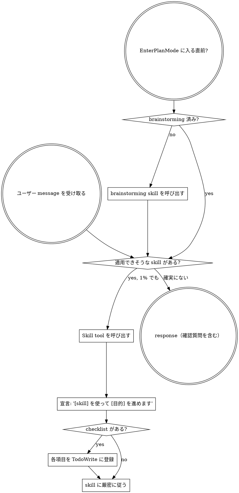

<SUBAGENT-STOP>
特定 task のために dispatch された subagent として動作している場合、この skill は skip する。
</SUBAGENT-STOP>

<EXTREMELY-IMPORTANT>
現在の作業に適用できる skill が 1% でもありそうなら、その skill を必ず呼び出す。

skill が task に適用される場合、選択肢はない。必ず使う。

これは交渉不可。optional ではない。理由をつけて回避してはいけない。
</EXTREMELY-IMPORTANT>

## Instruction Priority

Superpowers skills は default system prompt の振る舞いを上書きする。ただし、**ユーザー指示は常に最優先**。

1. **ユーザーの明示指示**（CLAUDE.md、GEMINI.md、AGENTS.md、直接依頼）— 最優先
2. **Superpowers skills** — conflict する箇所で default system behavior を上書き
3. **Default system prompt** — 最低優先度

CLAUDE.md、GEMINI.md、AGENTS.md が「TDD を使わない」と指示し、skill が「常に TDD を使う」と言う場合は、ユーザー指示に従う。control はユーザーにある。

## Skill へのアクセス方法

**Claude Code:** `Skill` tool を使う。skill を呼び出すと内容が読み込まれるので、そのまま従う。`Read` tool で skill file を直接読まない。

**Copilot CLI:** `skill` tool を使う。skill は install 済み plugin から自動発見される。`skill` tool は Claude Code の `Skill` tool と同じ役割を持つ。

**Hermes Agent:** `skill_view` tool で skill を読み込む。Hermes は 3 段階の progressive loading を持つ: `skills_list` で一覧 → `skill_view(name)` で full content → `skill_view(name, path)` で reference file。

**Gemini CLI:** `activate_skill` tool で skill を有効化する。Gemini は session 開始時に skill metadata を読み込み、必要に応じて full content を activate する。

**その他の環境:** platform documentation を確認し、skill loading の方法に従う。

## Platform Adaptation

skills は Claude Code の tool 名を使う。Claude Code 以外の platform では、次の mapping を確認する。

- Copilot CLI: `references/copilot-tools.md`
- Hermes Agent: `references/hermes-tools.md`
- Codex: `references/codex-tools.md`
- Qoder: `references/qoder-tools.md`
- Gemini CLI: GEMINI.md に tool mapping が自動注入される

# Using Skills

## Rules

**response、確認質問、操作の前に、関連する skill または明示的に求められた skill を呼び出す。** 適用可能性が 1% でもあれば、skill を呼び出して確認する。呼び出した結果、現在の状況に合わないと分かった場合は、その skill を使わなくてよい。

## Red Lines

次の考えが浮かんだら停止する。これは rationalization である。

| 思考 | 現実 |
| --- | --- |
| 「これはただの簡単な質問」 | 質問も task。skill を確認する。 |
| 「先にもう少し context が必要」 | clarifying question より先に skill check。 |
| 「まず codebase を見てから」 | skill が探索方法を教える。先に確認する。 |
| 「git / file を軽く見るだけ」 | file には会話 context がない。skill を確認する。 |
| 「先に情報収集だけする」 | skill が情報収集の進め方を教える。 |
| 「正式な skill は不要」 | skill があるなら使う。 |
| 「この skill は覚えている」 | skill は更新される。現在版を読む。 |
| 「これは task ではない」 | action = task。skill を確認する。 |
| 「skill は大げさ」 | 単純なものほど複雑化しやすい。使う。 |
| 「これだけ先にやる」 | 何かをする前に確認する。 |
| 「この方が効率的に感じる」 | discipline のない行動は時間を浪費する。skill がそれを防ぐ。 |
| 「意味は分かっている」 | concept を知っていることと skill を使うことは違う。呼び出す。 |

## Skill Priority

複数の skill が適用できそうな場合は、次の順序で使う。

1. **process skill を優先**（brainstorming、debugging）— task の扱い方を決める
2. **implementation skill を次に使う**（frontend design、mcp-builder）— 実行方法を導く

「X を作りましょう」→ 先に brainstorming、その後 implementation skill。

「この bug を直して」→ 先に debugging、その後 domain-specific skill。

## 日本向け Skill Routing

次の場面では、該当する日本向け skill を優先的に確認する。

| 場面 | 呼び出す skill |
| --- | --- |
| code review で日本語の team communication が必要 | **superpowers:japanese-code-review** |
| GitHub / GitLab / Bitbucket / Backlog / Redmine / Jira を使う開発 flow | **superpowers:japanese-git-workflow** |
| 日本語の仕様書、設計書、README、API 仕様、運用手順を書く | **superpowers:japanese-documentation** |
| 日本語 project の git commit message / changelog を書く | **superpowers:japanese-commit-conventions** |
| MCP server / tool を構築する | **superpowers:mcp-builder** |

**判断基準:**

- project に日本語 README、設計書、comment、Backlog / Redmine / Jira の参照がある → 日本向け skill を確認する
- commit 履歴や PR / MR が日本語 → `japanese-commit-conventions` を確認する
- ユーザーが日本語で依頼している → 出力は日本語を基本にし、日本の開発現場の確認観点を優先する

日本向け skill は翻訳済み upstream skill と**重ねて使う**。例: review 時は `requesting-code-review`（process）と `japanese-code-review`（表現・現場観点）を併用する。

## Skill Types

**Rigid**（TDD、debugging）: 厳密に従う。discipline から逸脱しない。

**Flexible**（pattern）: context に応じて principle を適用する。

skill 自体がどちらの type かを示す。

## User Instructions

instruction は「何をするか」を示すものであり、「workflow を skip してよい」という意味ではない。「X を追加して」「Y を修正して」は、workflow を省略する許可ではない。
