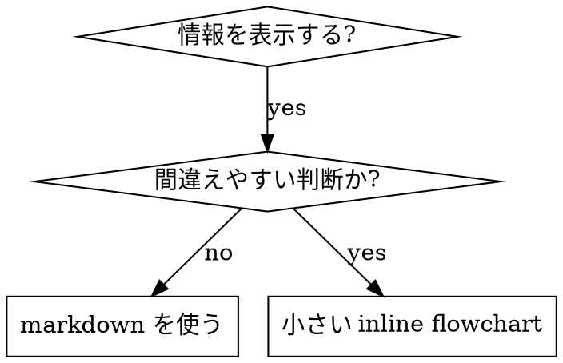

# Skill を書く

## 概要

**Skill 作成は、プロセス文書に TDD を適用する作業です。**

実装コードではなく `SKILL.md` を書きますが、考え方は同じです。まず失敗する pressure scenario を用意し、skill なしで agent がどう失敗するかを観察し、その失敗だけを防ぐ最小の skill を書き、再テストし、合理化の抜け道を塞ぎます。

**原則:** skill なしで agent が失敗するところを観察していないなら、その skill が正しい失敗を防いでいるかは分かりません。

**必須背景:** この skill を使う前に `superpowers:test-driven-development` を理解してください。RED-GREEN-REFACTOR の考え方を、ここでは文書と agent 行動の検証へ適用します。

**Anthropic 公式 guidance:** Anthropic の skill authoring best practices は `anthropic-best-practices.md` を参照してください。この skill は、それを TDD 寄りに運用するための補助です。

**個人 skill の保存先（参考）:** `~/.claude/skills`（Claude Code）、`~/.agents/skills/`（Codex 系）など、agent 別の personal directory に置きます。本 repo の skill は project / fork として共有するものを対象とします。

## Skill とは

Skill は、実績のある技法、思考パターン、tool の使い方を future agent が見つけて再利用できるようにする reference guide です。

**Skill に向くもの:** 複数 project で再利用する技法、判断基準、手順、reference。

**Skill に向かないもの:** 一回限りの作業記録、project 固有の約束事、既に標準文書が十分ある内容、regex や CI で機械的に強制できる制約。

## TDD 対応表

| TDD | Skill 作成 |
| --- | --- |
| Test case | subagent で実行する pressure scenario |
| Production code | `SKILL.md` |
| RED | skill なしで agent が rule を破る |
| GREEN | skill ありで agent が rule を守る |
| Refactor | compliance を保ったまま抜け道を塞ぐ |
| Test first | skill を書く前に baseline scenario を走らせる |
| Watch it fail | agent の合理化文言を逐語的に記録する |
| Minimal code | 観察した失敗だけを防ぐ内容を書く |
| Watch it pass | 同じ scenario で遵守を確認する |
| Refactor cycle | 新しい合理化を見つけ → 塞ぐ → 再検証する |

Skill 作成プロセス全体が RED-GREEN-REFACTOR で動きます。

## 作成判断

作成してよい条件:
- 直感だけでは再現しにくい
- 別 project でも参照しそう
- project 固有ではなく広く使える
- 他の人や future agent にも価値がある

作成しない条件:
- 一回限りの解決メモ
- project 固有の規約。これは `CLAUDE.md` や repository docs に置く
- 標準 practice の要約だけ
- regex / CI / validation で機械化できる制約。判断が必要な内容にだけ skill を割く

## Skill の種類

**Technique:** condition-based waiting、root-cause tracing のような具体的手順。

**Pattern:** flatten-with-flags、test invariants のような考え方。

**Reference:** API、構文、tool usage の早見表。

## Directory 構造

```text
skills/
  skill-name/
    SKILL.md              # 必須。主 reference
    supporting-file.*     # 必要な場合のみ
```

namespace は flat に保ちます。supporting file を分けるのは、100 行以上の重い reference、再利用 tool、template がある場合だけです。原則や短い code pattern は `SKILL.md` に inline で置きます。

## SKILL.md 構造

Frontmatter（YAML）:
- agentskills.io specification 上の必須 field は `name` と `description` の 2 つ（その他の field は [agentskills.io/specification](https://agentskills.io/specification) を参照）
- この repository の skill は Hermes compatibility のため、`version`、`license`、`metadata.hermes.tags` も必須とする
- frontmatter 全体で 1024 characters 以下を目安にする
- `name` は英数字と hyphen のみ。括弧や記号は使わない
- `description` は third person。**「いつ使うか」だけを書き、「何をするか」を書かない**
  - 「Use when ...」「... 時に使用する」の形で trigger 条件を最初に書く
  - 症状、状況、context を具体的に書く
  - **skill 本文の workflow を要約してはいけない**（理由は CSO section 参照）
  - できれば 500 characters 未満
- `metadata.hermes.tags` は短い discovery keyword の non-empty array にする

推奨構造:

```markdown
---
name: skill-name
description: [具体的な trigger / symptom / context、「... 時に使用する」]
version: "1.0.0"
license: MIT
metadata:
  hermes:
    tags: [category, keyword]
---

# Skill Name

## 概要
核心原則を 1-2 文で説明する。

## いつ使うか
[判断が non-obvious なら小さな inline flowchart]

症状、use case、使わない条件を bullet で書く。

## Core Pattern（technique / pattern 系）
before / after の比較、判断表、短い手順を書く。

## Quick Reference
頻出操作を表や bullet で scan しやすくする。

## Implementation
単純な pattern は inline。
重い reference や再利用 tool は別 file へ link する。

## Common Mistakes
失敗例と修正を書き、合理化の抜け道を塞ぐ。

## Real-World Impact（optional）
実案件で skill 投入前 / 投入後の効果が定量化できる場合のみ記載する。
```

## Claude Search Optimization (CSO)

**Future agent は `description` を読んで skill を load するか判断します。見つけられない skill は存在しないのと同じです。**

### 1. Rich Description Field

**目的:** agent は description を読んで「この skill を今読むべきか」を決めます。description は workflow を語る場ではなく、検索 metadata です。

**重要:** description は「いつ使うか」を書き、「何をするか」は書きません。

description に workflow を要約すると、agent が本文を読まずに description だけで実行する shortcut を取ります。実テストで「code review between tasks」のような description が原因で、本文 flowchart が二段階 review を求めているのに agent が一段階だけで終えてしまった事例があります。description を trigger 条件だけに直すと、本文の flowchart を読んで正しく動くようになりました。

```yaml
# ❌ BAD: workflow を要約しており、agent は本文を読まないことがある
description: 計画実行時、task ごとに subagent を起動し、間で code review を挟む

# ❌ BAD: process の詳細が多すぎる
description: TDD を実行する。test を先に書き、失敗を確認し、実装し、refactor する

# ✅ GOOD: trigger 条件だけ、workflow の要約なし
description: 実装計画を同一 session 内で順に実行する場合に使用する

# ✅ GOOD: trigger 条件だけ
description: 機能実装または bug 修正時、実装コードを書く前に使用する
```

**内容指針:**
- 具体的な trigger、症状、状況を書く
- 「race condition」「不整合な挙動」のように*問題*を書く。「`setTimeout`」「`sleep`」のような*特定言語の症状*に寄せすぎない
- skill 自体が特定技術依存でない限り、言語や framework に寄せすぎない
- 技術固有 skill の場合は、その技術名を trigger に明記する
- third person で書く（system prompt に注入される）
- **本文の workflow を要約しない**

```yaml
# ❌ BAD: 抽象的、いつ使うか含まれていない
description: 非同期 test 用

# ❌ BAD: first person
description: 不安定な async test を直したい時に手伝います

# ❌ BAD: 技術固有ではないのに特定構文に寄せている
description: tests が setTimeout / sleep を使っていて flaky な時に使用する

# ✅ GOOD: 「... 時に使用する」、問題で書き、workflow 要約なし
description: test に race condition、timing 依存、pass/fail のばらつきがある場合に使用する

# ✅ GOOD: 技術固有 skill で trigger を明記
description: React Router を使い、認証 redirect の挙動を扱う場合に使用する
```

### 2. Keyword Coverage

agent が検索しそうな語を含めます:
- エラーメッセージ: "Hook timed out"、"ENOTEMPTY"、"race condition"、「kintone 401」「LINE WORKS webhook 失敗」
- 症状: "flaky"、"hanging"、"zombie"、"pollution"、「不安定」「再現しない」「タイムアウト」
- 同義語: "timeout / hang / freeze"、"cleanup / teardown / afterEach"、「クリーンアップ / 後処理」
- tool 名: 実コマンド、library 名、file 拡張子

### 3. Descriptive Naming

active voice、動詞先頭で:
- ✅ `creating-skills` not `skill-creation`
- ✅ `condition-based-waiting` not `async-test-helpers`
- ✅ `japanese-incident-report` not `incident-management-jp`

### 4. Token Efficiency

**問題:** getting-started や頻繁参照される skill は会話開始時に毎回 load されます。token は希少資源です。

**目安の語数:**
- getting-started workflow: 1 skill あたり 150 words 未満
- 頻繁 load される skill: 合計 200 words 未満
- その他: 500 words 未満（それでも簡潔に）

**手段:**

**詳細は tool の help に逃がす:**
```bash
# ❌ BAD: SKILL.md に全 flag を転載
search-conversations は --text、--both、--after DATE、--before DATE、--limit N を受け付ける

# ✅ GOOD: --help を参照
search-conversations は複数 mode と filter を持つ。--help で詳細を確認。
```

**cross-reference で重複を避ける:**
```markdown
# ❌ BAD: 別 skill の workflow を再記述
検索時には次の template で subagent を起動する...
[20 行の再掲]

# ✅ GOOD: 別 skill を参照
必ず subagent を使う（context が 50-100 倍節約できる）。**必須:** `superpowers:<other-skill>` の workflow を使用する。
```

**example を圧縮:**
```markdown
# ❌ BAD: 冗長 (42 words)
利用者: 「React Router の authentication error を以前どう扱った?」
あなた: 過去の conversation を React Router authentication pattern で検索します
[subagent dispatch with search query: "React Router authentication error handling 401"]

# ✅ GOOD: 最小 (20 words)
利用者: 「React Router の auth error はどう扱った?」
あなた: 検索します
[subagent → synthesis]
```

**冗長を削る:**
- cross-reference 先で書かれていることを再記述しない
- コマンドから自明な内容を説明しない
- 同じ pattern の例を複数並べない

**検証:**
```bash
wc -w skills/path/SKILL.md
# getting-started workflow: 150 words 未満を目安
# 頻繁 load される skill: 合計 200 words 未満を目安
```

### 5. Cross-Referencing Other Skills

文書内で他 skill を参照するときは、skill 名のみを使い、要求の強さを明示します:

- ✅ Good: `**REQUIRED SUB-SKILL:** superpowers:test-driven-development を使用する`
- ✅ Good: `**REQUIRED BACKGROUND:** superpowers:systematic-debugging を必ず理解しておく`
- ❌ Bad: `skills/testing/test-driven-development を参照`（必須かどうか不明）
- ❌ Bad: `@skills/testing/test-driven-development/SKILL.md`（強制 load される）

**`@` 形式を使わない理由:** `@` 構文は file を即座に load し、参照しなくても 200k+ token を context に積みます。

## Flowchart

分岐が複雑な場合だけ Graphviz を使います。label は短く保ち、手続きの全詳細を diagram に押し込まないでください。



**flowchart を使う場面:**
- 非自明な判断点
- 早く止めてしまう恐れがある process loop
- 「A と B のどちらを使うか」判断

**flowchart を使わない場面:**
- reference 情報 → 表 / list
- code 例 → markdown code block
- 線形手順 → 番号付き list
- 意味のない label（step1、helper2）

graphviz の style は `graphviz-conventions.dot` に従います。skill の flowchart を SVG 化したいときは、同 directory の `render-graphs.js` を使えます:

```bash
./render-graphs.js ../some-skill           # diagram ごとに出力
./render-graphs.js ../some-skill --combine # 1 SVG にまとめる
```

## Code Examples

**良い例 1 つは凡庸な例 10 個に勝ります。**

target に近い language を選ぶ:
- testing 系 → TypeScript / JavaScript
- system debugging → Shell / Python
- data processing → Python
- 日本業務 system 文脈 → kintone JS、Salesforce Apex、Backlog / LINE WORKS webhook など現場で実在する組み合わせ

**良い例の条件:**
- 完結していて実行可能
- 「なぜそうするか」を簡潔に comment
- 実 scenario 由来（contrived example でない）
- pattern が見える
- adapt しやすい（fill-in-the-blank template でない）

**避ける:**
- 5 言語以上に展開する
- 穴埋め template にする
- 現場で起きない人工 scenario を書く

skill 利用側の agent は port できるので、優れた 1 例で十分です。

## File Organization

### Self-Contained Skill
```
defense-in-depth/
  SKILL.md    # すべて inline
```
全内容が `SKILL.md` に収まり、外部 reference が不要なとき。

### Skill with Reusable Tool
```
condition-based-waiting/
  SKILL.md    # 概要と pattern
  example.ts  # 適用しやすい working helper
```
再利用可能な code を提供したいとき。

### Skill with Heavy Reference
```
pptx/
  SKILL.md       # 概要と workflow
  pptxgenjs.md   # 600 行の API reference
  ooxml.md       # 500 行の XML 構造
  scripts/       # 実行 tool
```
reference 情報が inline で大きすぎるとき。

## The Iron Law（TDD と同じ）

```
NO SKILL WITHOUT A FAILING TEST FIRST
（先に失敗する test を観察していない skill は存在しない）
```

これは新規 skill にも、既存 skill の編集にも適用されます。

skill を test 前に書いた? 消してやり直す。test なしで skill を編集した? 同じ違反。

**例外なし:**
- 「単純な追記だから」「節を 1 つ足すだけだから」「文書 update だけだから」も適用される
- test なしの変更を「参考として残す」しない
- test を実行しながら skill を「adapt」しない
- 削除と言ったら削除

**必須背景:** `superpowers:test-driven-development` を参照。なぜ重要かが書かれており、同じ原則を文書に適用しています。

## Testing All Skill Types

skill 種別ごとに必要な test 強度が違います。

### Discipline-Enforcing Skill（rule / 要件強制）

**例:** TDD、verification-before-completion、designing-before-coding、receiving-code-review

**test 観点:**
- academic 質問: rule を理解しているか
- pressure scenario: 時間圧、sunk cost、疲労、authority など重ねた状態で守れるか
- 複数 pressure の組み合わせ
- 出た合理化を逐語的に拾い、明示的に counter する

**成功条件:** 最大圧下でも rule を守る。

### Technique Skill（how-to）

**例:** condition-based-waiting、root-cause-tracing、defensive-programming、`japanese-incident-report`

**test 観点:**
- application scenario: 技法を新規 case に正しく当てられるか
- variation scenario: edge case を扱えるか
- 情報欠落 test: 手順に gap がないか

**成功条件:** 新しい scenario で技法を正しく適用できる。

### Pattern Skill（mental model）

**例:** reducing-complexity、information-hiding

**test 観点:**
- 認識 scenario: pattern を適用すべき状況を識別できるか
- 適用 scenario: model を使って判断できるか
- 反例 scenario: 適用してはいけない状況を判別できるか

**成功条件:** いつ / どう適用するかを正しく判別できる。

### Reference Skill（document / API）

**例:** API document、CLI reference、library guide

**test 観点:**
- retrieval scenario: 必要な情報を引けるか
- application scenario: 引いた情報を正しく使えるか
- gap test: よくある use case が網羅されているか

**成功条件:** 引いた情報を正しく適用できる。

## Test を skip する合理化

| 合理化 | 現実 |
| --- | --- |
| 「skill が明らかに正しいから」 | あなたに明らかでも、他 agent に明らかとは限らない。test する |
| 「reference だから」 | reference にも欠落や不明瞭がある。retrieval を test する |
| 「test は overkill」 | 未 test の skill は必ず問題を起こす。15 分の test で数時間救える |
| 「問題が出たら test する」 | 問題が出る = agent が skill を使えていない。配布前に test する |
| 「test 作業が面倒」 | 本番で壊れた skill を debug する方が面倒 |
| 「自分は自信がある」 | 過信が問題を呼び込む。test する |
| 「読んだから十分」 | 読む ≠ 使う。application scenario で test する |
| 「test する時間がない」 | 未 test 配布は後で追加の時間を奪う |

**結論: 配布前に test する。例外なし。**

## Bulletproofing：合理化への対策

discipline 系 skill（TDD など）は、agent が圧力下で抜け道を探すことを前提に書きます。

**心理学的補足:** 説得手法がなぜ効くかを理解すると、systematic に適用しやすくなります。authority、commitment、scarcity、social proof、unity などの原理（Cialdini、2021; Meincke et al., 2025）は `persuasion-principles.md` を参照してください。

### 抜け道を 1 つずつ明示的に塞ぐ

rule を述べるだけでなく、具体的な workaround を禁じる:

❌ 不十分:
```markdown
test を書く前に実装した? 消す。
```

✅ 十分:
```markdown
test を書く前に実装した? 消す。最初から書き直す。

**例外なし:**
- 「参考に残す」しない
- test を書きながら「adapt」しない
- 見ない
- 削除と言ったら削除
```

### 「Spirit vs Letter」議論を封じる

skill の早い段階で原則を明示する:

```markdown
**rule の文言に違反することは、rule の精神に違反することと同じ。**
```

これで「精神には従っている」系の合理化を 1 行で切り落とせます。

### Rationalization Table を作る

baseline test で観察した言い訳を表に並べ、現実を書きます。日本現場での実例:

| 合理化 | 現実 |
| --- | --- |
| 「既存 code を参考に test を書く」 | 実装に合わせた test になり、TDD ではない |
| 「後で test を足す」 | test-first ではない。今止めて RED から始める |
| 「動作確認 PDF を添えたから受入条件を満たした」 | 受入条件は文書化された criteria で評価する。証跡を判定基準に紐付ける |
| 「customer 報告は時間がないので後日」 | 障害初報は影響が出た時点で必須。続報・最終報告で update する |

### Red Flags リストを作る

agent が自分で気づけるように、危険語を列挙します:

```markdown
## Red Flags - STOP and Start Over

- 「test 前に実装した」
- 「手動で確認したから十分」
- 「test-after でも同じ目的」
- 「これは特殊な case だから」
- 「精神に従っている」
- 「customer に説明済みなので証跡は不要」

**いずれも: 止めて RED からやり直す。**
```

### CSO に違反 symptom を含める

description にも、違反直前の症状を入れて、skill を発見しやすくします:

```yaml
description: 機能実装または bug 修正時、実装コードを書く前に使用する。
```

## RED-GREEN-REFACTOR for Skills

### RED: failing test を書く（baseline）

skill なしで realistic な pressure scenario を実行します。逐語的に記録します:
- どの選択肢を選んだか
- どんな合理化を使ったか（原文ママ）
- どの圧力が違反を引き起こしたか

ここで agent が自然にどう失敗するかを観察しないと、skill が何を防ぐべきかが決まりません。

### GREEN: 最小 skill を書く

観察した合理化だけを防ぐ最小文書を書きます。仮想的な edge case や網羅説明を足しすぎないでください。

skill ありで同じ scenario を再実行し、agent が遵守することを確認します。

### REFACTOR: 抜け道を塞ぐ

agent が新しい合理化を見つけた? 明示的な counter を追加して、再 test。圧力下でも守れるまで繰り返します。

**Testing 方法論:** pressure scenario の書き方、pressure 種類（time、sunk cost、authority、exhaustion）、抜け道を systematic に塞ぐ手順、meta-testing は `testing-skills-with-subagents.md` を参照してください。

## Anti-Patterns

### ❌ Narrative Example
「2025-10-03 の session で、空の projectDir が原因で...」
**なぜ駄目か:** specific すぎ、再利用できない。

### ❌ Multi-Language Dilution
`example-js.js`、`example-py.py`、`example-go.go` を並列で並べる。
**なぜ駄目か:** どれも凡庸になり、保守負担も増える。

### ❌ Code in Flowcharts
```dot
step1 [label="import fs"];
step2 [label="read file"];
```
**なぜ駄目か:** copy できず、読みにくい。

### ❌ Generic Labels
`helper1`、`helper2`、`step3`、`pattern4`
**なぜ駄目か:** label は意味を持たせる。検索もできない。

## STOP: 次の skill に進む前に

**1 つの skill を書いたら、必ず止まって deployment 手順を完了させてください。**

**やってはいけないこと:**
- 複数 skill をまとめて書いて test を後回しにする
- 現 skill の検証が終わる前に次に行く
- 「batch の方が効率がいい」と test を skip する

**下の deployment checklist は skill ごとに必須です。**

未 test 配布は、未 test code の配布と同じ品質違反です。

## Skill 作成 Checklist（TDD 適用版）

**重要: TodoWrite で下の項目ごとに todo を作って進めてください。**

**RED 段階 - failing test を書く:**
- [ ] pressure scenario を作る（discipline 系は 3+ pressure 組み合わせ）
- [ ] skill なしで scenario を実行し baseline を逐語記録
- [ ] 合理化 / 失敗の pattern を抽出する

**GREEN 段階 - 最小 skill を書く:**
- [ ] name は英数字と hyphen のみ（括弧・記号なし）
- [ ] YAML frontmatter に `name`、`description`、`version`、`license`、`metadata.hermes.tags` を入れる（1024 chars 以下、[spec](https://agentskills.io/specification)）
- [ ] description は「Use when ... / ... 時に使用する」で始める
- [ ] description は third person
- [ ] error message、symptom、tool 名など検索 keyword を本文に散らす
- [ ] core principle を明示した概要
- [ ] RED で観察した具体的失敗を直接 address している
- [ ] code は inline か別 file への link か明確
- [ ] excellent な 1 例を載せる（多言語並列にしない）
- [ ] skill ありで scenario を再実行し遵守を確認

**REFACTOR 段階 - 抜け道を塞ぐ:**
- [ ] test で出た新しい合理化を特定
- [ ] discipline 系なら明示的 counter を追加
- [ ] 反復 test で観察した合理化を table 化
- [ ] red flags list を作る
- [ ] bulletproof になるまで再 test

**Quality Check:**
- [ ] flowchart は非自明な判断点のみ
- [ ] quick reference table を入れる
- [ ] common mistakes section を入れる
- [ ] narrative storytelling を入れない
- [ ] supporting file は tool / 重い reference の場合だけ

**Deployment:**
- [ ] skill を commit し、fork に push（設定済みの場合）
- [ ] 広く有用なら upstream PR を検討
- [ ] 日本 SI / 受託開発 / SaaS で頻出する成果物 skill は `evals/transcripts/` に eval transcript を残す

## Discovery Workflow

future agent が skill に到達する流れ:

1. 問題に遭遇する（「test が flaky」「kintone webhook が落ちる」）
2. description を検索し skill を見つける（description が trigger を含むこと）
3. overview を scan する（読む価値があるか）
4. pattern / quick reference を読む
5. example を必要な時だけ load する

**この流れに最適化** — 検索される語を early & often に置きます。

## Real-World Impact（optional）

skill の有無で behavior 差が測れる場合のみ、定量的に書きます。例:

- 「TDD skill 投入前は pressure scenario で 8 / 10 が test なしで実装。投入後は 2 / 10 まで減少」
- 「`japanese-incident-report` 投入前は初報に影響範囲記述が無いケースが 60%。投入後は 0%」

定量データがない場合は省略します。narrative の感想だけを書くと anti-pattern の Narrative Example になります。

## Stop Before Publishing

公開前に確認してください:

- [ ] skill なしで失敗する baseline を観察した
- [ ] agent の合理化を逐語的に記録した
- [ ] skill は観察した失敗を直接防いでいる
- [ ] description は trigger だけで workflow を要約していない
- [ ] pressure scenario で skill ありの遵守を確認した
- [ ] 新しい抜け道を red flags / table / rule に反映した
- [ ] supporting file は必要なものだけ
- [ ] frontmatter が valid（`name`、`description`、`version`、`license`、`metadata.hermes.tags`、1024 chars 以下）
- [ ] cross-reference 先が存在する
- [ ] discipline 系なら Iron Law / 例外なし宣言が入っている
- [ ] 日本現場固有 skill の場合、受入条件・証跡・承認の考え方を必要に応じて補っている

## まとめ

**Skill 作成 IS TDD for process documentation.**

同じ Iron Law — failing test なしに skill なし。
同じ cycle — RED（baseline）→ GREEN（最小 skill）→ REFACTOR（抜け道封鎖）。
同じ benefit — 品質が上がり、surprise が減り、圧力下でも守れる。

code に TDD を適用しているなら、skill にも適用してください。同じ discipline を文書に当てているだけです。
