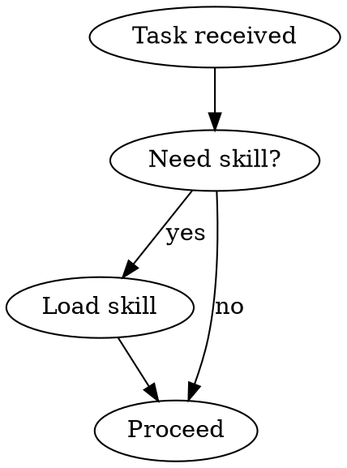

# Skill を書く

## 概要

**Skill 作成は、プロセス文書に TDD を適用する作業です。**

実装コードではなく `SKILL.md` を書きますが、考え方は同じです。まず失敗する pressure scenario を用意し、skill なしで agent がどう失敗するかを観察し、その失敗だけを防ぐ最小の skill を書き、再テストし、合理化の抜け道を塞ぎます。

**原則:** skill なしで agent が失敗するところを観察していないなら、その skill が正しい失敗を防いでいるかは分かりません。

**必須背景:** この skill を使う前に `superpowers:test-driven-development` を理解してください。RED-GREEN-REFACTOR の考え方を、ここでは文書と agent 行動の検証へ適用します。

Anthropic の skill authoring best practices は `anthropic-best-practices.md` を参照してください。この skill は、それを TDD 寄りに運用するための補助です。

## Skill とは

Skill は、実績のある技法、思考パターン、tool の使い方を future agent が見つけて再利用できるようにする reference guide です。

**Skill に向くもの:** 複数 project で再利用する技法、判断基準、手順、reference。

**Skill に向かないもの:** 一回限りの作業記録、project 固有の約束事、既に標準文書が十分ある内容、regex や CI で機械的に強制できる制約。

## TDD 対応表

| TDD | Skill 作成 |
| --- | --- |
| Test case | subagent で実行する pressure scenario |
| Production code | `SKILL.md` |
| RED | skill なしで agent が rule を破る |
| GREEN | skill ありで agent が rule を守る |
| Refactor | compliance を保ったまま抜け道を塞ぐ |
| Test first | skill を書く前に baseline scenario を走らせる |
| Watch it fail | agent の合理化文言を逐語的に記録する |
| Minimal code | 観察した失敗だけを防ぐ内容を書く |
| Watch it pass | 同じ scenario で遵守を確認する |

## 作成判断

作成してよい条件:
- 直感だけでは再現しにくい
- 別 project でも参照しそう
- project 固有ではなく広く使える
- 他の人や future agent にも価値がある

作成しない条件:
- 一回限りの解決メモ
- project 固有の規約。これは `CLAUDE.md` や repository docs に置く
- 標準 practice の要約だけ
- validation で自動化できる単純制約

## Skill の種類

**Technique:** condition-based waiting、root-cause tracing のような具体的手順。

**Pattern:** flatten-with-flags、test invariants のような考え方。

**Reference:** API、構文、tool usage の早見表。

## Directory 構造

```text
skills/
  skill-name/
    SKILL.md              # 必須。主 reference
    supporting-file.*     # 必要な場合のみ
```

namespace は flat に保ちます。supporting file を分けるのは、100 行以上の重い reference、再利用 tool、template がある場合だけです。原則や短い code pattern は `SKILL.md` に inline で置きます。

## SKILL.md 構造

Frontmatter:
- `name` と `description` は必須
- `name` は英数字と hyphen
- `description` は「いつ使うか」だけを書く
- workflow の要約を書かない。agent が本文を読まず description だけで実行する shortcut になる
- できれば 500 characters 未満

推奨構造:

```markdown
---
name: skill-name
description: [具体的な trigger / symptom / context]
---

# Skill Name

## 概要
核心原則を 1-2 文で説明する。

## いつ使うか
症状、use case、使わない条件を書く。

## Core Pattern
before / after、判断表、短い手順を書く。

## Quick Reference
頻出操作を表や bullet で scan しやすくする。

## Common Mistakes
失敗例と修正を書き、合理化の抜け道を塞ぐ。
```

## Claude Search Optimization

Future agent は `description` を読んで skill を load するか判断します。見つけられない skill は存在しないのと同じです。

良い description:
- trigger、symptom、context が具体的
- third person
- skill 本文の workflow を要約しない
- 技術固有 skill でない限り、言語や framework に寄せすぎない

悪い description:

```yaml
description: TDD を実行する。test を先に書き、失敗を確認し、実装し、refactor する。
```

良い description:

```yaml
description: 機能実装または bug 修正時、実装コードを書く前に使用する。
```

description に workflow を書くと、agent が本文を読まずに不完全な理解で実行することがあります。description は「読むべきか」を判断させる検索 metadata に徹してください。

## Token 効率

Skill は必要な時に素早く読める必要があります。

- `SKILL.md` は判断と実行に必要な最小限にする
- 長い API reference、prompt、example は別 file に分ける
- CLI flags は全文転載せず `--help` や公式 docs を参照する
- 他 skill の内容を再説明せず、実在する `superpowers:<skill-name>` 形式の参照で cross-reference する
- example は短く、失敗しやすい point だけを示す

## Flowchart

分岐が複雑な場合だけ Graphviz を使います。label は短く保ち、手続きの全詳細を diagram に押し込まないでください。



## Testing

すべての skill を同じ強度で test する必要はありません。

**強く test する:** TDD、verification、review など、agent が時間圧や作業済み code を理由に破りたくなる discipline-enforcing skill。

**軽く test する:** technique skill。代表 scenario で正しい手順に進むか確認する。

**構造確認で十分:** API reference や syntax guide。link、path、example の正確性を確認する。

詳しい pressure testing は `testing-skills-with-subagents.md` を使います。

## 合理化への対策

Agent は rule を破るとき、もっともらしい理由を作ります。baseline test と pressure test で出た言い訳は、skill 本文で明示的に塞ぎます。

よくある言い訳:
- 「今回は急ぎなので」
- 「手動確認したので十分」
- 「精神には従っている」
- 「実務的にはこの方が早い」
- 「後で test / review する」
- 「既存 code を参考として残すだけ」

対策:
- 「例外なし」を明記する
- rationalization table を置く
- red flags を置き、その言葉が出たら止める
- description にも violation symptom を入れ、skill が発見されるようにする

例:

| 言い訳 | 現実 |
| --- | --- |
| 「既存 code を参考に test を書く」 | 実装に合わせた test になる。TDD ではない。 |
| 「後で test を足す」 | それは test-first ではない。今止めて RED から始める。 |

## RED-GREEN-REFACTOR

### RED: baseline を取る

skill なしで realistic な pressure scenario を実行します。agent がどの選択肢を選び、どんな理由で rule を破るかを逐語的に記録します。

### GREEN: 最小 skill を書く

観察した失敗を防ぐための最小文書を書きます。仮説上の例外や網羅的な説明を足しすぎないでください。

### REFACTOR: 抜け道を塞ぐ

skill ありでも破られた場合、新しい合理化を捕まえ、rule、table、red flags、description のいずれかに反映して再テストします。

## Anti-Patterns

**Narrative example:** 「私はこう解決した」という物語を書く。future agent が再利用しにくい。

**Multi-language dilution:** 一つの skill に複数言語や framework の長い例を詰める。trigger と pattern がぼやける。

**Flowchart に code を入れる:** diagram は判断に使い、実装詳細は本文や別 file に置く。

**Generic labels:** `helper`、`process`、`stuff` のような検索できない名前を使う。

## Stop Before Publishing

公開前に確認してください:

- [ ] skill なしで失敗する baseline を観察した
- [ ] agent の合理化を逐語的に記録した
- [ ] skill は観察した失敗を直接防いでいる
- [ ] description は trigger だけで workflow を要約していない
- [ ] pressure scenario で skill ありの遵守を確認した
- [ ] 新しい抜け道を red flags / table / rule に反映した
- [ ] supporting file は必要なものだけ
- [ ] frontmatter が valid
- [ ] cross-reference 先が存在する

## Discovery Workflow

1. 既存の失敗、review 指摘、繰り返し説明している作法を集める
2. それが project 固有か、汎用 skill にすべきか分ける
3. pressure scenario を書く
4. skill なしで baseline を取る
5. 最小の `SKILL.md` を書く
6. skill ありで再テストする
7. 抜け道を塞ぐ
8. README / docs / manifest の参照を更新する

## まとめ

良い skill は、きれいな説明文ではなく、future agent の行動を変える検証済みの reference です。失敗を観察し、最小限で直し、圧力下でも守れるまで refactor してください。
